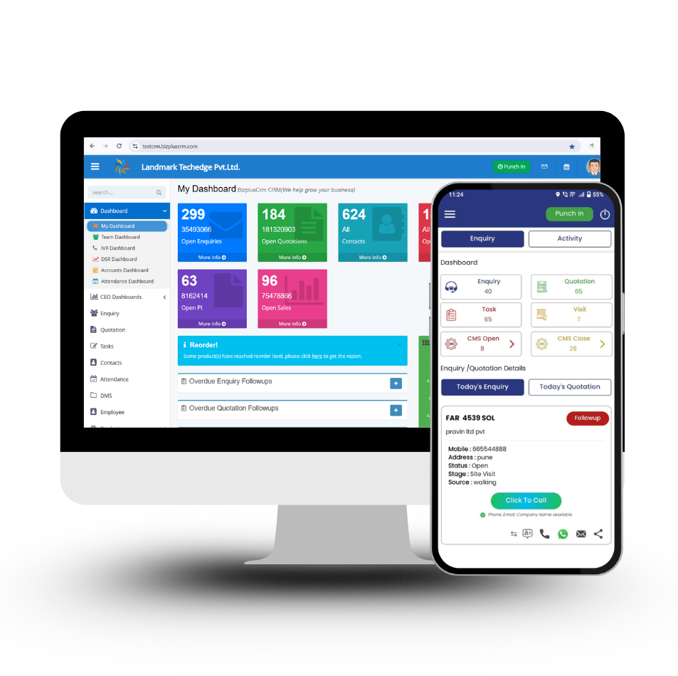

<h1 align="center">🚀 BizPlus CRM – Best CRM for Companies</h1>

  A modern, cloud-based CRM platform designed to help companies manage leads,
  automate sales, and scale faster.

  

<h2>📌 About BizPlus CRM</h2>

  <strong>BizPlus CRM</strong> is the <strong>best CRM for companies</strong> looking to streamline
  sales operations, centralize customer data, and improve team productivity.
  Built for startups, SMEs, and growing enterprises, BizPlus CRM replaces
  spreadsheets with a powerful, easy-to-use CRM solution.

<ul>
  <li>✔ Centralized lead & customer management</li>
  <li>✔ Sales automation & follow-ups</li>
  <li>✔ Real-time dashboards & reports</li>
  <li>✔ WhatsApp & Email integration</li>
  <li>✔ Secure cloud-based access</li>
</ul>

<h2>✨ Key Features</h2>

<ul>
  <li><strong>Unified Lead & Deal Hub</strong> – Manage all leads and deals in one place</li>
  <li><strong>Sales Automation</strong> – Automate tasks, reminders, and follow-ups</li>
  <li><strong>Mobile-Ready CRM</strong> – Access your CRM anytime, anywhere</li>
  <li><strong>WhatsApp & Email Communication</strong> – Built-in messaging</li>
  <li><strong>Smart Analytics</strong> – Real-time sales insights and performance tracking</li>
  <li><strong>Role-Based Access</strong> – Secure user permissions</li>
</ul>

<h2>🧩 Core Modules</h2>

<ul>
  <li>Lead Management Module</li>
  <li>Deal & Pipeline Tracking</li>
  <li>Task & Follow-Up Automation</li>
  <li>Quotation & Invoice Management</li>
  <li>WhatsApp & Email Communication</li>
  <li>Smart Dashboards & Reports</li>
  <li>Custom Fields & Workflow Builder</li>
  <li>Cloud-Based CRM Platform</li>
</ul>

<h2>🏢 Who Is It For?</h2>

  BizPlus CRM is ideal for:

<ul>
  <li>Startups looking to organize sales</li>
  <li>SMEs aiming to automate lead management</li>
  <li>Enterprises seeking scalable CRM solutions</li>
  <li>Sales-driven companies that need visibility & control</li>
</ul>

<h2>🔐 Technology Stack</h2>

<ul>
  <li><strong>Frontend:</strong> HTML, CSS, Bootstrap, JavaScript</li>
  <li><strong>Backend:</strong> REST APIs</li>
  <li><strong>Database:</strong> Cloud-based storage</li>
  <li><strong>Integrations:</strong> WhatsApp, Email, Analytics</li>
</ul>

<h2>📞 Get Started</h2>

  Ready to experience the <strong>best CRM for companies</strong>?

<ul>
  <li>🌐 Website: <a href="https://www.bizpluscrm.com" target="_blank">https://www.bizpluscrm.com</a></li>
  <li>📧 Email: support@bizpluscrm.com</li>
  <li>📞 Phone: +91 8899 07 7077</li>
</ul>

<h2>📄 License</h2>

  This project is proprietary software owned by <strong>BizPlus CRM</strong>.
  Unauthorized copying or redistribution is prohibited.

  <strong>⭐ If you like this project, give it a star on GitHub!</strong>

